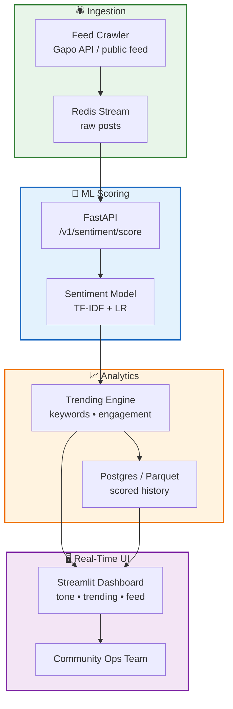

# Gapo Social — Sentiment Analysis & Real-Time Monitor

Open-source **Python ML** platform for Vietnamese social sentiment: auto crawler, TF-IDF classifier, **FastAPI** scoring service, and **Streamlit** dashboard for trending topics and user tone on Gapo Social (2020).

**Role:** ML Engineer · **Year:** 2021

## Tech Stack

| Component | Library / Tool |
|-----------|----------------|
| Crawler | `requests`, rate-limited feed API client |
| NLP | `underthesea` (Vietnamese tokenization ready), scikit-learn |
| Model | TF-IDF + Logistic Regression (`sentiment_v1.joblib`) |
| API | FastAPI + Uvicorn |
| Dashboard | Streamlit (auto-refresh) |
| Queue (prod) | Redis stream between crawler & scorer |

## Architecture



## Quick Start

```bash
python -m venv .venv && .venv\Scripts\activate
pip install -r requirements.txt
python scripts/run_pipeline.py

# API
uvicorn src.api.main:app --reload --port 8000

# Dashboard
streamlit run dashboard/app.py
```

## API Example

```bash
curl -X POST http://localhost:8000/v1/sentiment/score \
  -H "Content-Type: application/json" \
  -d "{\"texts\": [\"app chạy mượt quá\", \"lag kinh khủng\"]}"
```

## Repository Layout

```
gapo-sentiment-analytics/
├── src/crawler/       # Feed ingestion
├── src/ml/            # Train + inference
├── src/analytics/     # Trending aggregation
├── src/api/           # FastAPI service
├── dashboard/         # Streamlit monitor
└── scripts/           # Batch pipeline demo
```

---

*Portfolio reconstruction. No Gapo production credentials or user data.*
